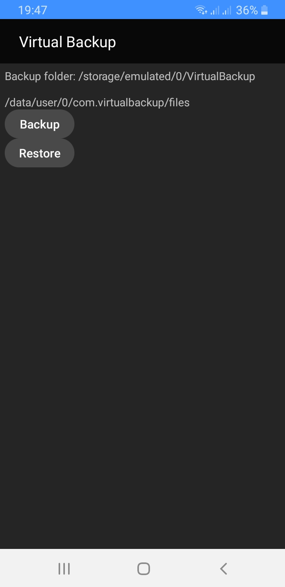

# Virtual Backup

A simple utility for moving application data from one virtual space to another.

The application needs to be installed in both virtual spaces. Make "Backup" in source virtual space, after that "Restore" in destination virtual space.

For example, in the video showed the transfer of the Dungeon Village game data from Parallel Space to VirtualXposed. 

[Moving application data between virtual spaces - Virtual Backup](http://gameguardian.net/v-518)

